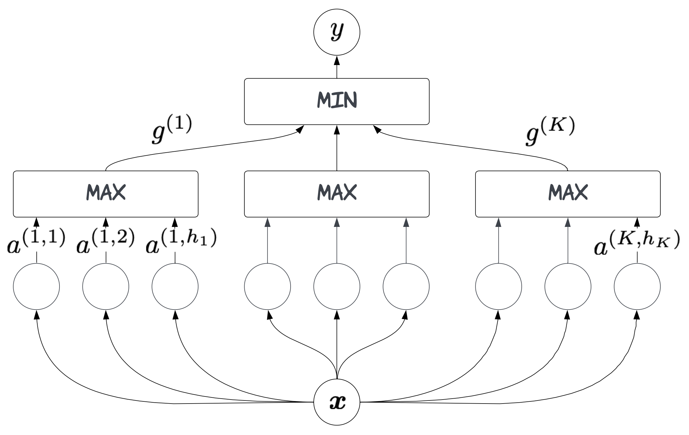

# Smooth Min-Max Monotonic Networks


Monotonicity constraints are powerful regularizers in statistical modelling. They can support fairness in computer-aided decision making and increase plausibility in data-driven scientific models. The seminal min-max (MM, [Still, 1997](https://papers.nips.cc/paper_files/paper/1997/hash/83adc9225e4deb67d7ce42d58fe5157c-Abstract.html)) neural network architecture ensures monotonicity, but often gets stuck in undesired local optima during training because of partial derivatives being zero when computing extrema. A simple modification of the MM network using strictly-increasing smooth minimum and maximum functions that alleviates this problem. The resulting smooth min-max (SMM, [Igel, 2024](https://arxiv.org/abs/2306.01147)) network module inherits the asymptotic approximation properties from the MM architecture. It can be used within larger deep learning systems trained end-to-end. The SMM module is conceptually simple and computationally less demanding than state-of-the-art neural networks for monotonic modelling. Experiments show that this does not come with a loss in generalization performance compared to alternative neural and non-neural approaches.


### Code 
The directory [`ICML2014 Supplement`](ICML2014%20Supplement) contains the PyTorch code for reproducing the experiments presented in the ICML 2024 paper introducing SMM networks [[Igel, 2024](https://icml.cc/virtual/2024/poster/33186)].
The code is not very clean (e.g., containing several slightly different ways to implement the SMM).

A little bit cleaner (but not very efficient) are the implementations in:

 - [`SmoothMonotonicNN.py`](SmoothMonotonicNN.py): Implementation of SMM module, restricted to non-decreasing constraints and scalar output                                              
 - [`SMM_MLP.py`](SMM_MLP.py): Very simple example of how the SMM module can be combined with other layers

### Paper
You can read about the approch here:

Christian Igel. [Smooth Min-Max Monotonic Networks](https://icml.cc/virtual/2024/poster/33186). *International Conference on Machine Learning*, 2024

Christian Igel. [Smooth Min-Max Monotonic Networks](https://arxiv.org/abs/2306.01147). *arXiv:2306.01147v3* [cs.LG], 2024

### Example 
Toy example using [`SmoothMonotonicNN.py`](SmoothMonotonicNN.py):

```python
# Set the stage
import numpy as np
import torch 
import matplotlib.pyplot as plt
from SmoothMonotonicNN import SmoothMonotonicNN

# Toy example: Sigmoid with additive Gaussian noise
N = 20  # number of data points
x = np.linspace(-5, 5, N)
y = 1. / (np.exp(-x) + 1.) + np.random.normal(0, 0.1, N)

# Create model
mask = np.array([1])  # monotonic in the first (and only) argument
K = 6  # neurons per group
model = SmoothMonotonicNN(1, K, K, mask)  # define SMM

# Optimize model
optimizer = torch.optim.Rprop(model.parameters(), lr=0.01, etas=(0.5, 1.2), step_sizes=(1e-06, 50))
loss_function = torch.nn.MSELoss()

x_tensor = torch.from_numpy(x.reshape(N,-1).astype(np.float32))
y_tensor = torch.from_numpy(y.astype(np.float32))

max_iterations = 200  # Numper of epochs
for epoch in range(max_iterations):
    y_hat = model(x_tensor)
    loss = loss_function(y_hat, y_tensor)
    loss.backward()
    optimizer.step()
    model.zero_grad()

# Evaluate on training set
y_hat = model(x_tensor).detach().numpy()

# Visualize result
plt.plot(x, y, 'o', label = "data")
plt.plot(x, y_hat, label = "SMM")
plt.grid()
plt.xlabel("x")
plt.ylabel("y");

```
